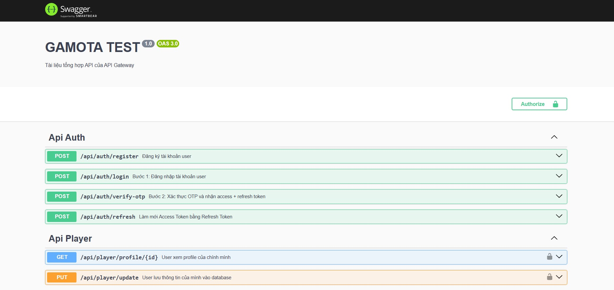

  

<h2 align="center">GAMOTA INTERN TEST</h2>

  Dự án test thực tập Backend tại <strong>GAMOTA / GABROS Studio</strong>, 
  xây dựng bằng <strong>NestJS Microservices</strong> và các công nghệ liên quan.

---

## 🚀 1. Tính năng chính

- Đăng ký tài khoản  
- Đăng nhập + xác thực 2 lớp (OTP)  
- Cấp JWT Access Token & Refresh Token  
- Update trạng thái player  
- RBAC – Role-based Access Control  

---

## 🧠 2. Công nghệ sử dụng

| Công nghệ | Mục đích |
|-----------|----------|
| NestJS | Backend core |
| gRPC | Giao tiếp giữa Microservices |
| Redis | Cache + KeyValue Store |
| RabbitMQ | Message Queue xử lý Email |
| JWT | Authentication |
| Docker | Chạy Redis & RabbitMQ |
| Swagger | API Testing |
| RBAC | Authorization |
| CORS, Helmet, Rate Limit, Validation Pipe | Security |
| MySQL | Lưu dữ liệu người dùng |

---

## 🏗 3. Kiến trúc hệ thống

- API_Gateway --> Auth_Service
- API_Gateway --> Player_Service
- Auth_Service --> Redis
- Auth_Service --> RabbitMQ
- RabbitMQ --> Email_Service

---

## ⚙ 4. Cài đặt Node.js và MySQL Server ( Nếu chưa có )

| Phần mềm | Link tải |
|----------|----------|
| Node.js | https://nodejs.org/en/download/ |
| MySQL | https://dev.mysql.com/downloads/installer/ |

---

## 📦 5. Clone 4 Service

- `git clone https://github.com/DANG-PH/GAMOTA_TEST_API_GATEWAY`
- `git clone https://github.com/DANG-PH/GAMOTA_TEST_AUTH_SERVICE`
- `git clone https://github.com/DANG-PH/GAMOTA_TEST_PLAYER_SERVICE`
- `git clone https://github.com/DANG-PH/GAMOTA_TEST_EMAIL_SERVICE`

---

## 🐳 6. Chạy Redis & RabbitMQ 

### Redis
`docker run -d --name redis -p 6379:6379 redis`

### RabbitMQ 
`docker run -d --name rabbitmq -p 5672:5672 -p 15672:15672 rabbitmq:management`

### Link tải nếu không dùng Docker
| Phần mềm | Link tải |
|----------|----------|
| Redis (Windows → bản stable) | https://github.com/tporadowski/redis/releases |
| RabbitMQ (Windows) | https://www.rabbitmq.com/install-windows.html |
| Erlang (bắt buộc cho RabbitMQ) | https://www.erlang.org/downloads |

---

## ⚙ 7. Cài đặt

Vào từng project và chạy:

- `npm install`
- `cp .env.example .env`   # hoặc tự tạo file .env ở cùng cấp /src
- `npm run start:dev`

---

## ⚙ 8. Cấu hình Database

Vào 2 project Auth và Player và tìm file .env ở cùng cấp /src
và sửa các cấu hình:

- `DB_HOST` # mặc định localhost
- `DB_PORT` # mặc định 3306 ( hoặc thay đổi nếu bạn đổi cổng )
- `DB_USER` # mặc định root
- `DB_PASS` # mật khẩu cần thay đổi theo MySQL bạn cấu hình trước đó
- `DB_NAME` # Database Name bạn muốn lưu vào ( lưu ý bạn phải tạo sẵn 2 database như trên )

---

## 📌 9. Truy cập Swagger

`http://localhost:<PORT>/api-docs` #PORT của API GATEWAY

Sau khi truy cập giao diện sẽ hiện ra như sau:

  

Click vào API cần test, bấm `Try it out` và xác nhận `Execute`
Lúc này Response sẽ hiện ra

---

## 🧪 10. Flow Test API

| Step | API | Kết quả |
|------|-----|----------|
| Register | POST /api/auth/register | Tạo user |
| Login | POST /api/auth/login | Nhận sessionId |
| Verify OTP | POST /api/auth/verify-otp | Trả về JWT |
| Update Player | PUT /api/player/update | Update thông tin |

---

<b>Cảm ơn bạn đã trải nghiệm dự án!</b>

💬 Liên hệ: Phạm Hải Đăng – Email: dangph.ptit@gmail.com<i>(nếu cần)</i>
